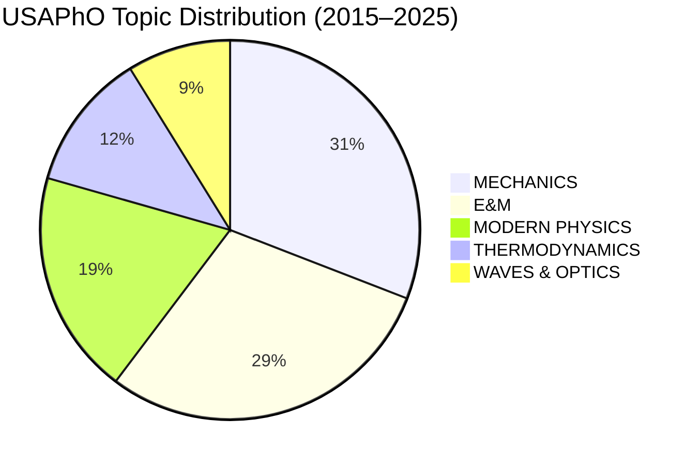
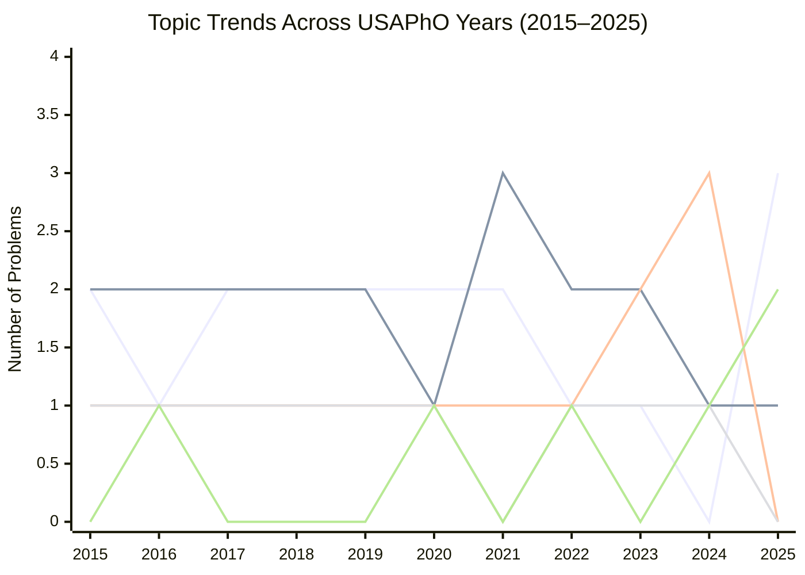

# USAPhO Semi-Final Exam: Topic Analysis Report (2015–2025)

> [!NOTE]
> This report analyzes **only the USAPhO semi-final (semifinal) exams**, excluding all F=ma / Fnet=ma preliminary exams. Data covers **11 exam years** (2015–2025) with a total of **66 problems**.

---

## 1. Complete Problem-by-Problem Topic Classification

Each problem is classified using a **two-tier hierarchy**: **MAJOR TOPIC > Sub-topic**.

---

### 2015 (Part A: 4 problems, Part B: 2 problems) — [Exam PDF](https://aapt.org/physicsteam/2015/upload/E3-2-5.pdf) | [Solutions](https://aapt.org/physicsteam/upload/USAPhO-2015-Solutions.pdf)

| Problem | Title / Description | Major Topic | Sub-topic(s) |
|---------|-------------------|-------------|--------------|
| A1 | Bouncing Neutron | MODERN PHYSICS | Quantum Mechanics |
| A2 | DC Circuit Analysis | E&M | DC Circuits |
| A3 | Two-Block Spring System with Friction | MECHANICS | Oscillations & Friction |
| A4 | Heat Engine with Piston | THERMODYNAMICS | Heat Engines & Phase Diagrams |
| B1 | Ideal Rocket & Orbital Transfers | MECHANICS | Orbital Mechanics & Rocket Motion |
| B2 | Magnetic Dipoles (Gilbert vs Ampere) | E&M | Magnetostatics |

---

### 2016 (Part A: 4 problems, Part B: 2 problems) — [Exam PDF](https://aapt.org/physicsteam/upload/USAPhO-2016.pdf) | [Solutions](https://aapt.org/physicsteam/upload/USAPhO-2016-Solutions.pdf)

| Problem | Title / Description | Major Topic | Sub-topic(s) |
|---------|-------------------|-------------|--------------|
| A1 | Moving Source Doppler Effect | WAVES & OPTICS | Doppler Effect |
| A2 | World Lines & Length Contraction | MODERN PHYSICS | Special Relativity |
| A3 | Op-Amps & RC Circuits | E&M | Electronics / Circuits |
| A4 | Ice Growth on a Lake | THERMODYNAMICS | Heat Transfer & Phase Change |
| B1 | Ball on Loop-the-Loop | MECHANICS | Rotational Dynamics & Energy Conservation |
| B2 | Electron Orbit in Charged Sphere + Radiation | E&M | Electrostatics & Radiation |

---

### 2017 (Part A: 4 problems, Part B: 2 problems) — [Exam PDF](https://aapt.org/physicsteam/2018/upload/2017-USAPhO-exam-2.pdf) | [Solutions](https://aapt.org/physicsteam/upload/USAPhO-2017-Solutions.pdf)

| Problem | Title / Description | Major Topic | Sub-topic(s) |
|---------|-------------------|-------------|--------------|
| A1 | Two Wedges System | MECHANICS | Dynamics & Friction |
| A2 | Carnot Engine with Multiple Objects | THERMODYNAMICS | Carnot Cycle & Heat Engines |
| A3 | Ship's Compass & Induced Magnetism | E&M | Magnetism |
| A4 | Domino Toppling (Impulse) | MECHANICS | Impulse & Rotational Dynamics |
| B1 | Cosmic Ray Energy Limit (Δ particle) | MODERN PHYSICS | Particle Physics & Relativity |
| B2 | Van de Graaff Accelerator | E&M | Electrostatics & Particle Beams |

---

### 2018 (Part A: 3 problems, Part B: 3 problems) — *Format change to 3+3* — [Exam PDF](https://aapt.org/physicsteam/2019/upload/USAPhO-2018.pdf) | [Solutions](https://aapt.org/physicsteam/upload/USAPhO-2018-Solutions.pdf)

| Problem | Title / Description | Major Topic | Sub-topic(s) |
|---------|-------------------|-------------|--------------|
| A1 | Block-Sphere Collision on Ramp | MECHANICS | Impulse & Rigid Body Dynamics |
| A2 | Current–Voltage Device | E&M | Electronics / Circuits |
| A3 | Vacuum Pump System | THERMODYNAMICS | Gas Laws & Pressure |
| B1 | Charge Distributions (Cube, Pyramid) | E&M | Electrostatics |
| B2 | Heisenberg Uncertainty & Telescope Mirror | MODERN PHYSICS | Quantum Mechanics & Optics |
| B3 | Radiation Pressure on Solar System Particles | MECHANICS | Gravitation & Radiation Pressure |

---

### 2019 (Part A: 3 problems, Part B: 3 problems) — [Exam PDF](https://aapt.org/physicsteam/upload/2019_USAPhO.pdf) | [Solutions](https://aapt.org/physicsteam/upload/USAPhO-2019-Solutions.pdf)

| Problem | Title / Description | Major Topic | Sub-topic(s) |
|---------|-------------------|-------------|--------------|
| A1 | Two Blocks on Incline | MECHANICS | Dynamics & Friction |
| A2 | Solar Energy → Wind Power Model | THERMODYNAMICS | Stefan-Boltzmann & Heat Engines |
| A3 | Charge Transport in Semiconductor | E&M | Electrodynamics & Diffusion |
| B1 | Elastic Membrane / Neuron Ion Pump | E&M | Electrostatics & Elasticity |
| B2 | "Stellar Black Box" — Star Properties | MODERN PHYSICS | Blackbody Radiation & Astrophysics |
| B3 | "Pitfall" — Bead on Rail with Rod | MECHANICS | Rotational Dynamics & Energy Conservation |

---

### 2020 (Part A: 3 problems, Part B: 3 problems) — [Exam PDF](https://aapt.org/Common/upload/2020_USAPhO.pdf) | [Solutions](https://aapt.org/Common/upload/2020_USAPhO_solutions.pdf)

| Problem | Title / Description | Major Topic | Sub-topic(s) |
|---------|-------------------|-------------|--------------|
| A1 | Charged Wire & Cylindrical Shell | E&M | Electrostatics & Angular Momentum |
| A2 | Foucault Pendulum | MECHANICS | Rotating Reference Frames |
| A3 | Relativistic Circular Race Track | MODERN PHYSICS | Special Relativity |
| B1 | "String Cheese" — Falling Water Stream | MECHANICS | Fluid Dynamics & Surface Tension |
| B2 | "Mirror Mirror" — Interference Fringes | WAVES & OPTICS | Wave Optics / Interference |
| B3 | Real Gas Free Expansion | THERMODYNAMICS | Entropy & Free Expansion |

---

### 2021 (Part A: 3 problems, Part B: 3 problems) — [Exam PDF](https://aapt.org/Common2022/upload/2021-USAPhO.pdf) | [Solutions](https://aapt.org/Common2022/upload/2021-USAPhO_Solutions_v3.pdf)

| Problem | Title / Description | Major Topic | Sub-topic(s) |
|---------|-------------------|-------------|--------------|
| A1 | Muon Kinematics (Alice & Bob) | MODERN PHYSICS | Special Relativity |
| A2 | Classical Electron Model (Spherical Shell) | E&M | Electrostatics & Classical EM |
| A3 | Ant on Rotating Disk | MECHANICS | Rotational Dynamics & Angular Momentum |
| B1 | Airplane Flight Model | MECHANICS | Fluid Dynamics & Aerodynamics |
| B2 | ABRACADABRA Axion Detector (Toroid) | E&M | Magnetism & Inductance |
| B3 | Classical Hall Effect | E&M | Electrodynamics & Condensed Matter |

---

### 2022 (Part A: 3 problems, Part B: 3 problems) — [Exam PDF](https://aapt.org/physicsteam/upload/2022-USAPhO-Exam.pdf) | [Solutions](https://aapt.org/physicsteam/upload/2022-USAPhO-solutions.pdf)

| Problem | Title / Description | Major Topic | Sub-topic(s) |
|---------|-------------------|-------------|--------------|
| A1 | "Moment of Clarity" — Rod Bending | MECHANICS | Statics & Bending Moments |
| A2 | Charged Liquid Metal Droplet | E&M | Electrostatics & Surface Tension |
| A3 | "Rainbow Road" — Raindrop Optics | WAVES & OPTICS | Geometric Optics / Refraction |
| B1 | "Virial Reality" — Real Gas Virial Expansion | THERMODYNAMICS | Statistical Mechanics & Gas Laws |
| B2 | Charged Ring & Point Charge Oscillation | E&M | Electrostatics & Oscillations |
| B3 | "Time Crystal" — Particle Energy-Momentum | MODERN PHYSICS | Lagrangian / Advanced Mechanics |

---

### 2023 (Part A: 3 problems, Part B: 3 problems) — [Exam PDF](https://aapt.org/physicsteam/upload/2023-USAPhO-Exam.pdf) | [Solutions](https://aapt.org/physicsteam/upload/2023-USAPhO-solutions.pdf)

| Problem | Title / Description | Major Topic | Sub-topic(s) |
|---------|-------------------|-------------|--------------|
| A1 | "Circus Act" — Ball Bouncing on Surfaces | MECHANICS | Dynamics & Collisions |
| A2 | Charged Particle in Plane of Fixed Charges | E&M | Electrostatics & Oscillations |
| A3 | "The Motive Power of Ice" — Carnot & Phase Change | THERMODYNAMICS | Carnot Cycle & Phase Change |
| B1 | Solenoid & Conducting Rod — EM Induction | E&M | Electromagnetic Induction |
| B2 | "Fast and Furious" — Relativistic Spaceship | MODERN PHYSICS | Special Relativity |
| B3 | "Starry Messengers" — Supernova Light | MODERN PHYSICS | Astrophysics & Radiation |

---

### 2024 (Part A: 3 problems, Part B: 3 problems) — [Exam PDF](https://aapt.org/physicsteam/upload/USAPhO_Exam_24.pdf) | [Solutions](https://aapt.org/physicsteam/upload/2024-USAPhO-Exam_solutions.pdf)

| Problem | Title / Description | Major Topic | Sub-topic(s) |
|---------|-------------------|-------------|--------------|
| A1 | Stellar Hydrostatic Equilibrium | MODERN PHYSICS | Astrophysics & Gravitation |
| A2 | Quantum Heat Capacity of Solids | THERMODYNAMICS | Quantum Statistical Mechanics |
| A3 | Photography Optics & Photon Statistics | WAVES & OPTICS | Geometric Optics & Photon Statistics |
| B1 | Muon Decay (Relativistic Lifetime) | MODERN PHYSICS | Special Relativity & Particle Physics |
| B2 | White Dwarf Mass–Radius Relation | MODERN PHYSICS | Quantum Mechanics & Astrophysics |
| B3 | RLC Circuit Resonance & Q Factor | E&M | AC Circuits & Resonance |

---

### 2025 (Part A: 3 problems, Part B: 3 problems) — [Exam PDF](https://aapt.org/physicsteam/upload/USAPhO_Exam_25.pdf) | [Solutions](https://aapt.org/physicsteam/upload/2025-USAPhO-Exam_solutions.pdf)

| Problem | Title / Description | Major Topic | Sub-topic(s) |
|---------|-------------------|-------------|--------------|
| A1 | "Shake It" — Animal Shaking Off Water | MECHANICS | Rotational Dynamics & Surface Tension |
| A2 | "Black Tides" — Tidal Disruption of Stars | MECHANICS | Gravitation & Tidal Forces |
| A3 | "Bitter and Magnetic" — Multi-Layer Solenoid | E&M | Magnetism & Electromagnet Design |
| B1 | "Scroll 'n' Roll" — Ant on Rotating Disk | MECHANICS | Rotational Dynamics & Momentum |
| B2 | "Where's the Kaboom?" — Flying Plane Acoustics | WAVES & OPTICS | Acoustics & Doppler Effect |
| B3 | "Locked and Moded" — Fabry–Pérot Resonator | WAVES & OPTICS | Wave Optics / Interference |

---

## 2. Statistical Analysis by Major Topic

### 2.1 Overall Frequency (2015–2025, N=66 problems)

| Major Topic | Count | Percentage | Avg per Year |
|-------------|-------|-----------|--------------|
| **MECHANICS** | 21 | 31.8% | 1.91 |
| **E&M** | 20 | 30.3% | 1.82 |
| **MODERN PHYSICS** | 13 | 19.7% | 1.18 |
| **THERMODYNAMICS** | 8 | 12.1% | 0.73 |
| **WAVES & OPTICS** | 6 | 9.1% | 0.55 |

> [!IMPORTANT]
> Some problems involve sub-topics that cross boundaries (e.g., photon statistics in Optics, radiation pressure in Mechanics). The classification above assigns each problem to its **primary** major topic.

---

### 2.2 Sub-Topic Frequency Breakdown

#### MECHANICS (21 problems)

| Sub-topic | Count | % of Mechanics |
|-----------|-------|---------------|
| Rotational Dynamics & Angular Momentum | 6 | 28.6% |
| Dynamics & Friction | 4 | 19.0% |
| Fluid Dynamics & Surface Tension | 3 | 14.3% |
| Gravitation & Orbital Mechanics | 3 | 14.3% |
| Impulse & Rigid Body | 2 | 9.5% |
| Oscillations | 1 | 4.8% |
| Statics & Bending | 1 | 4.8% |
| Rotating Reference Frames | 1 | 4.8% |

#### E&M (20 problems)

| Sub-topic | Count | % of E&M |
|-----------|-------|---------|
| Electrostatics | 6 | 30.0% |
| Magnetism & Inductance | 4 | 20.0% |
| Electronics / AC Circuits | 3 | 15.0% |
| Electrodynamics & Radiation | 3 | 15.0% |
| DC Circuits | 1 | 5.0% |
| Magnetostatics (Dipoles) | 1 | 5.0% |
| Electromagnetic Induction | 1 | 5.0% |
| Classical EM Models | 1 | 5.0% |

#### MODERN PHYSICS (13 problems)

| Sub-topic | Count | % of Modern |
|-----------|-------|------------|
| Special Relativity | 5 | 38.5% |
| Quantum Mechanics | 3 | 23.1% |
| Astrophysics & Radiation | 3 | 23.1% |
| Particle Physics | 2 | 15.4% |

#### THERMODYNAMICS (8 problems)

| Sub-topic | Count | % of Thermo |
|-----------|-------|-------------|
| Heat Engines & Carnot Cycle | 3 | 37.5% |
| Gas Laws & Pressure | 2 | 25.0% |
| Phase Change & Heat Transfer | 2 | 25.0% |
| Entropy & Free Expansion | 1 | 12.5% |

#### WAVES & OPTICS (6 problems)

| Sub-topic | Count | % of Waves |
|-----------|-------|-----------|
| Geometric Optics (Refraction, Lenses) | 2 | 33.3% |
| Wave Optics / Interference | 2 | 33.3% |
| Doppler Effect & Acoustics | 2 | 33.3% |

---

## 3. Year-by-Year Topic Distribution

| Year | MECH | E&M | MODERN | THERMO | WAVES | Total |
|------|------|-----|--------|--------|-------|-------|
| 2015 | 2 | 2 | 1 | 1 | 0 | 6 |
| 2016 | 1 | 2 | 1 | 1 | 1 | 6 |
| 2017 | 2 | 2 | 1 | 1 | 0 | 6 |
| 2018 | 2 | 2 | 1 | 1 | 0 | 6 |
| 2019 | 2 | 2 | 1 | 1 | 0 | 6 |
| 2020 | 2 | 1 | 1 | 1 | 1 | 6 |
| 2021 | 2 | 3 | 1 | 0 | 0 | 6 |
| 2022 | 1 | 2 | 1 | 1 | 1 | 6 |
| 2023 | 1 | 2 | 2 | 1 | 0 | 6 |
| 2024 | 0 | 1 | 3 | 1 | 1 | 6 |
| 2025 | 3 | 1 | 0 | 0 | 2 | 6 |

**Chart Legend** *(lines are rendered in chart order, top to bottom)*

| # | Topic | 2015 | 2016 | 2017 | 2018 | 2019 | 2020 | 2021 | 2022 | 2023 | 2024 | 2025 |
|---|-------|------|------|------|------|------|------|------|------|------|------|------|
| 1st line | **Mechanics** | 2 | 1 | 2 | 2 | 2 | 2 | 2 | 1 | 1 | 0 | 3 |
| 2nd line | **E&M** | 2 | 2 | 2 | 2 | 2 | 1 | 3 | 2 | 2 | 1 | 1 |
| 3rd line | **Modern Physics** | 1 | 1 | 1 | 1 | 1 | 1 | 1 | 1 | 2 | 3 | 0 |
| 4th line | **Thermodynamics** | 1 | 1 | 1 | 1 | 1 | 1 | 0 | 1 | 1 | 1 | 0 |
| 5th line | **Waves & Optics** | 0 | 1 | 0 | 0 | 0 | 1 | 0 | 1 | 0 | 1 | 2 |

---

## 4. Trend Analysis & Key Findings

### 4.1 Dominant Topics — The "Big Two"

**Mechanics** and **E&M** together account for **62.1%** of all problems (41 out of 66). This is the exam's core backbone.

- **Mechanics** appears in **10 out of 11 years** (absent only in 2024), averaging ~1.9 problems/year
- **E&M** appears in **all 11 years**, averaging ~1.8 problems/year
- Together they guarantee **3–4 problems per exam** in most years

### 4.2 Rising Trend — Modern Physics

| Period | Modern Physics Avg/Year |
|--------|------------------------|
| 2015–2019 (early) | 1.0 |
| 2020–2022 (middle) | 1.0 |
| 2023–2024 (recent) | 2.5 |

> [!TIP]
> **Modern Physics saw a sharp increase in 2023–2024**, reaching 2–3 problems per exam. Sub-topics like **Special Relativity** (5 total appearances) and **Astrophysics applications** (3 appearances, concentrated in 2023–2024) are driving this growth. Students should prioritize relativistic kinematics, particle physics thresholds, and astrophysical modeling.

### 4.3 Steady Presence — Thermodynamics

Thermodynamics maintains a **remarkably consistent** 1 problem per year (present in 9 of 11 years, absent in 2021 and 2025). The most common sub-topics:
- **Heat Engines / Carnot Cycle** (3 times — 2015, 2017, 2023)
- **Gas Laws** (2 times — 2018, 2022)
- **Phase Change** (2 times — 2016, 2023)

### 4.4 Intermittent Appearances — Waves & Optics

Waves & Optics is the **least frequent** major topic (6/66 = 9.1%), appearing in only **6 of 11 years**. However:
- **2025 saw 2 Waves/Optics problems** (Acoustics + Fabry–Pérot), the highest in any single year
- Topics rotate between geometric optics, wave interference, and acoustics/Doppler

### 4.5 Cross-Disciplinary & Applied Problems — A Growing Trend

A notable trend across years is the increase in **cross-disciplinary and real-world application** problems:

| Year | Cross-Disciplinary Problem Examples |
|------|-------------------------------------|
| 2019 | Solar-to-wind energy, stellar properties, neuron membrane |
| 2020 | Foucault pendulum, falling water stream |
| 2021 | Airplane aerodynamics, axion detector, Hall effect |
| 2022 | Raindrop optics (rainbows), liquid metal droplet |
| 2023 | Supernova light, relativistic spacecraft |
| 2024 | White dwarf physics, digital photography optics, stellar equilibrium |
| 2025 | Tidal disruption events, animal shaking mechanics, Fabry–Pérot resonator |

> [!IMPORTANT]
> **Post-2018 exams increasingly embed physics in astrophysical, biological, and engineering contexts.** Pure textbook problems are becoming rare. Students should practice applying fundamental physics to unfamiliar, multi-step real-world scenarios.

---

## 5. Summary Statistics

### 5.1 Reliability of Each Topic Appearing

| Topic | Appeared in N/11 Years | Reliability |
|-------|----------------------|-------------|
| E&M | 11/11 | **Always** |
| Mechanics | 10/11 | **Near-certain** |
| Modern Physics | 10/11 | **Near-certain** |
| Thermodynamics | 9/11 | **Very likely** |
| Waves & Optics | 6/11 | **Moderate** |

### 5.2 Most Common Sub-Topics (Top 10)

| Rank | Sub-topic | Count | Major Topic |
|------|-----------|-------|-------------|
| 1 | Rotational Dynamics & Angular Momentum | 6 | MECHANICS |
| 2 | Electrostatics | 6 | E&M |
| 3 | Special Relativity | 5 | MODERN PHYSICS |
| 4 | Dynamics & Friction | 4 | MECHANICS |
| 5 | Magnetism & Inductance | 4 | E&M |
| 6 | Heat Engines & Carnot Cycle | 3 | THERMODYNAMICS |
| 7 | Fluid Dynamics & Surface Tension | 3 | MECHANICS |
| 8 | Gravitation & Orbital Mechanics | 3 | MECHANICS |
| 9 | Quantum Mechanics | 3 | MODERN PHYSICS |
| 10 | Electronics / AC Circuits | 3 | E&M |

### 5.3 Rarest Sub-Topics (Appeared Only Once)

These sub-topics have appeared on **only 1 problem** across the entire 11-year period. They are unpredictable but can catch students off-guard.

| Sub-topic | Major Topic | Year | Problem | Context |
|-----------|-------------|------|---------|---------|
| Oscillations (spring + friction) | MECHANICS | 2015 | A3 | Two-block spring system |
| Statics & Bending Moments | MECHANICS | 2022 | A1 | Rod as a bridge |
| Rotating Reference Frames | MECHANICS | 2020 | A2 | Foucault pendulum |
| DC Circuits (Ohm/Kirchhoff) | E&M | 2015 | A2 | Current source + voltmeter/ammeter |
| Magnetostatics (Dipoles) | E&M | 2015 | B2 | Gilbert vs Ampere dipole models |
| Electromagnetic Induction | E&M | 2023 | B1 | Solenoid + conducting rod |
| Classical EM Models | E&M | 2021 | A2 | Classical electron as spherical shell |
| Entropy & Free Expansion | THERMODYNAMICS | 2020 | B3 | Real gas into vacuum |
| Quantum Stat. Mech. (solids) | THERMODYNAMICS | 2024 | A2 | Einstein/Debye heat capacity model |
| Lagrangian / Advanced Mechanics | MODERN PHYSICS | 2022 | B3 | "Time Crystal" energy-momentum |
| Condensed Matter (Hall Effect) | E&M | 2021 | B3 | Classical Hall effect in fields |
| Photon Statistics | WAVES & OPTICS | 2024 | A3 | Signal-to-noise in photography |
| Fabry–Pérot / Interferometry | WAVES & OPTICS | 2025 | B3 | Cavity resonator modes |

> [!WARNING]
> Rare sub-topics are **not** low-importance — they often appear as multi-part problems worth significant points. A single "surprise" problem in Lagrangian mechanics, condensed matter, or interferometry can differentiate top scorers. Students aiming for the top 20 should have at least passing familiarity with all items above.

### 5.4 Never-Appeared Sub-Topics (Within Olympiad Syllabus)

The following sub-topics fall within the standard physics olympiad syllabus (IPhO / USAPhO scope) but have **never appeared as a primary topic** in any USAPhO semi-final problem from 2015–2025. They could appear in future exams.

#### MECHANICS

| Sub-topic | Notes |
|-----------|-------|
| Pure Projectile Motion | Always embedded in larger problems, never standalone |
| Elasticity / Young's Modulus | Bending appeared once (2022), but material stress–strain has not |
| Center-of-Mass Kinematics | Used implicitly but never the main focus |
| Simple Pendulum (standalone) | Foucault pendulum appeared, but not a classic pendulum problem |
| Coupled Oscillators / Normal Modes | Absent despite being common in IPhO |

#### E&M

| Sub-topic | Notes |
|-----------|-------|
| Dielectrics & Capacitors | Never a primary topic; capacitance ideas appear inside other problems |
| RC / RL Transient Circuits | Op-amp and RLC appeared, but standalone transient analysis has not |
| Electromagnetic Waves / Maxwell's Equations | Wave propagation, Poynting vector, etc. — never primary |
| Transmission Lines / Waveguides | Advanced but within IPhO syllabus |
| Biot-Savart Law (standalone) | Magnetic field calculations appear, but never a pure Biot-Savart problem |

#### THERMODYNAMICS

| Sub-topic | Notes |
|-----------|-------|
| Kinetic Theory of Gases (standalone) | Deriving pressure from molecular motion — never primary |
| Thermal Expansion | Common in AP Physics but absent from USAPhO |
| Calorimetry | Too elementary for USAPhO level |
| Adiabatic Processes (standalone) | Embedded in engine problems but never the sole focus |

#### WAVES & OPTICS

| Sub-topic | Notes |
|-----------|-------|
| Single-Slit Diffraction | Diffraction concepts appeared within other problems, never standalone |
| Diffraction Gratings | Common in IPhO but absent from USAPhO 2015–2025 |
| Polarization | Never tested as a primary topic |
| Thin-Film Interference | A classic optics topic, completely absent |
| Standing Waves in Pipes / Strings | Resonance appeared (RLC), but acoustic standing waves have not |

#### MODERN PHYSICS

| Sub-topic | Notes |
|-----------|-------|
| Photoelectric Effect | A staple of introductory physics, but never a USAPhO problem |
| Compton Scattering | Within syllabus but untested |
| Bohr Model / Hydrogen Atom | Energy levels appeared via quantum mechanics, but not Bohr specifically |
| Nuclear Physics (Decay, Binding Energy) | Particle physics appeared, but nuclear reactions/binding energy have not |
| General Relativity | Beyond typical scope, but gravitational lensing/time dilation could appear |
| de Broglie Wavelength (standalone) | Used within quantum problems but never the primary focus |

> [!TIP]
> These gaps represent **potential "new territory"** for future exams. The USAPhO committee has shown a pattern of introducing previously untested sub-topics (e.g., Fabry–Pérot in 2025, Hall effect in 2021). Sub-topics like **polarization**, **diffraction gratings**, and **electromagnetic waves** are overdue based on IPhO coverage patterns.

### 5.5 Exam Format Shift

| Period | Format | Problems |
|--------|--------|----------|
| 2015–2017 | 4A + 2B | 6 per year |
| 2018–2025 | 3A + 3B | 6 per year |

> [!NOTE]
> The format shifted in 2018 from a 4+2 structure to a balanced 3+3 structure. Part A tends to feature core topics (Mechanics, E&M, Thermo), while Part B often includes more advanced or modern topics.

---

## 6. Recommendations for Students

Based on the statistical analysis:

1. **Must-prepare topics** (appear nearly every year):
   - Mechanics: Rotational dynamics, dynamics with friction, gravitation
   - E&M: Electrostatics, magnetism, circuits (DC and AC)
   - Special Relativity: Time dilation, relativistic energy/momentum

2. **High-value topics** (frequent and high-weight):
   - Thermodynamics: Carnot cycle, gas laws, phase changes
   - Quantum Mechanics: Uncertainty principle, energy levels, quantum models

3. **Emerging topics** (increasing in recent years):
   - Astrophysics applications (stellar models, white dwarfs, tidal disruption)
   - Cross-disciplinary modeling (bio-physics, engineering contexts)
   - Wave optics & Fabry–Pérot / interferometry

4. **Don't neglect** (intermittent but still tested):
   - Geometric optics, Doppler effect, fluid dynamics
   - Particle physics (energy thresholds, decay)

---

*Report generated May 2025. Data sourced from AAPT official exam archives and verified against multiple educational resources.*
