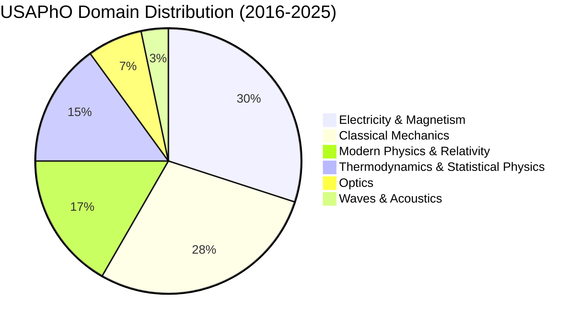
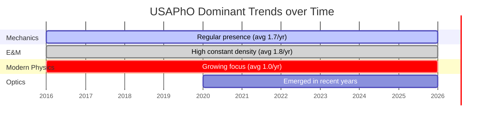

# USA Physics Olympiad (USAPhO) Preparation Guide & Statistical Report (2016-2025)

This report serves as a comprehensive study guide and strategic analysis for students preparing for the USA Physics Olympiad (USAPhO) semi-final exam. It is based on a detailed analysis of all **60 free-response problems** from the past 10 years of USAPhO exams (2016–2025). Preliminary *F=ma* exams, which focus purely on mechanics, are excluded to isolate the specific style, topics, and difficulty distribution of the semi-final tier.

---

## 1. Executive Summary & Key Takeaways

The USAPhO is a calculus-based, free-response exam designed to test the depth of a student’s physical intuition and mathematical execution. Through analyzing 10 years of exams, several high-yield patterns emerge:

1. **The Core Pillars**: **Electricity & Magnetism (30.0%)** and **Classical Mechanics (28.3%)** together constitute nearly 60% of the exam. Mastery of these two subjects is a strict prerequisite for earning a medal.
2. **The "Three-Problem" Structure**: Standard USAPhO exams are divided into two parts: Part A (3 problems, 90 minutes) and Part B (3 problems, 90 minutes). 
   * *Part A* typically focuses on **Mechanics**, **Thermodynamics**, and **Optics/Waves**.
   * *Part B* frequently features **Electricity & Magnetism**, **Special Relativity**, and **Modern/Astrophysics**.
3. **The Rise of Modern Physics**: **Modern Physics & Relativity (16.7%)** is the third most frequent topic. Special Relativity kinematics (time dilation, length contraction, and Lorentz transformations) and relativistic collisions appear consistently (almost every year).
4. **The Shift in Optics**: Optics has transitioned from being rarely tested (0 problems between 2016 and 2019) to a highly regular appearance (appearing in 4 out of the last 6 years, with a positive trend slope of **+0.109**). Both geometric optics (lens systems, refraction, caustics) and wave optics (interference, Fabry-Perot cavities) are now fair game.
5. **High-Yield Math Tools**: Beyond basic calculus, USAPhO requires a strong grasp of **ordinary differential equations (ODEs)** (for AC circuits and falling fluids), **Taylor series approximations** (crucial for finding equilibrium and stability conditions), and **superposition principles** in electrostatic and gravitational fields.

---

## 2. Topic Hierarchy & Statistical Analysis

Problems have been classified into a three-tier hierarchy:
* **Level 1**: Broad Physics Domain
* **Level 2**: Sub-Topic Grouping
* **Level 3**: Specific Physical Phenomenon or System

### 2.1 Level 1 Domain Distribution

The overall distribution of the 60 analyzed problems across the primary domains of physics is summarized below:

| Physics Domain | Problem Count | Percentage | Historical Trend (Slope) |
| :--- | :---: | :---: | :---: |
| **Electricity & Magnetism (E&M)** | 18 | 30.0% | -0.048 / year (Stable) |
| **Classical Mechanics** | 17 | 28.3% | -0.018 / year (Stable) |
| **Modern Physics & Relativity** | 10 | 16.7% | +0.036 / year (Slight Increase) |
| **Thermodynamics & Statistical Physics** | 9 | 15.0% | -0.079 / year (Slight Decrease) |
| **Optics** | 4 | 6.7% | +0.109 / year (Strong Increase) |
| **Waves & Acoustics** | 2 | 3.3% | +0.000 / year (Occasional) |
| **Total** | **60** | **100%** | |

---

### 2.2 Level 2 Sub-Topic Breakdown

Within each domain, problems target specific sub-topics. Preparing students should prioritize the highest-frequency sub-topics:

#### **Electricity & Magnetism (30.0% of Exam)**
* **Electrodynamics & Induction (13.3% overall)**: Faraday's law, rotating conductors in magnetic fields, self-inductance, and electromagnetic radiation.
* **Electrostatics & Field Energy (10.0% overall)**: Potential and field integrations, energy stored in fields, classical models of the electron, and electrostatic pressure.
* **Electric Circuits & Devices (6.7% overall)**: Non-linear circuit elements, operational amplifiers (op-amps), and AC circuits (resonance, impedance, quality factor $Q$).

#### **Classical Mechanics (28.3% of Exam)**
* **Dynamics & Conservation Laws (11.7% overall)**: Rigid body rotation, sliding-to-rolling transitions, collisions with friction, and Lagrangian mechanics with constraint equations.
* **Kinematics & Statics (8.3% overall)**: Double-wedge static equilibrium, Foucault pendulums (Coriolis forces), and bending moments/shear stress in beams.
* **Fluid Dynamics & Surface Tension (5.0% overall)**: Falling streams, surface tension instabilities (Rayleigh-Plateau), and boundary layers.
* **Orbital Mechanics & Gravitation (3.3% overall)**: Kepler's laws, gravitational potentials, and tidal forces.

#### **Modern Physics & Relativity (16.7% of Exam)**
* **Special Relativity Kinematics (6.7% overall)**: Time dilation, length contraction, Lorentz coordinates transformation, and world-line diagrams.
* **Astrophysics & Cosmology (3.3% overall)**: Star properties, blackbody spectra, supernova neutrino mass bounds, and white dwarf stability.
* **Relativistic Dynamics (3.3% overall)**: Particle decays, center-of-mass energy, and relativistic rocket equations.
* **Quantum Mechanics (3.3% overall)**: Wave packet dispersion, group/phase velocity, and the uncertainty principle in optical devices.

#### **Thermodynamics & Statistical Physics (15.0% of Exam)**
* **Thermodynamic Cycles & Engines (6.7% overall)**: Carnot engines (finite heat capacities, phase transitions) and atmospheric engines.
* **Gas Laws & Real Gases (5.0% overall)**: Piston pump compression cycles, virial expansions for non-ideal gases, and real gas free expansion.
* **Heat Transfer & Convection (1.7% overall)**: Lake freezing rates and Fourier's law of conduction.
* **Statistical & Quantum Thermodynamics (1.7% overall)**: Einstein and Debye models of solid heat capacity.

#### **Optics (6.7% of Exam)**
* **Geometric Optics (3.3% overall)**: Converging/diverging lenses (tilt-shift cameras) and light scattering/caustics (rainbows).
* **Wave Optics & Interference (3.3% overall)**: Fabry-Perot cavities (mode locking) and mirror interference in square rooms.

#### **Waves & Acoustics (3.3% of Exam)**
* **Doppler Effect (1.7% overall)**: Moving sound sources and beat frequencies.
* **Acoustic Kinematics (1.7% overall)**: Sonic booms and shockwave geometry.

---

### 2.3 Chronological Domain Trends

The table below shows the distribution of topics by year. Each year contains exactly 6 problems (except 2016 and 2017, which had 4 in Part A and 2 in Part B, still totaling 6):

| Year | Classical Mechanics | Electricity & Magnetism | Modern Physics & Relativity | Optics | Thermodynamics | Waves & Acoustics | Total |
| :---: | :---: | :---: | :---: | :---: | :---: | :---: | :---: |
| **2016** | 1 | 2 | 1 | 0 | 1 | 1 | **6** |
| **2017** | 2 | 2 | 1 | 0 | 1 | 0 | **6** |
| **2018** | 2 | 2 | 1 | 0 | 1 | 0 | **6** |
| **2019** | 2 | 2 | 0 | 0 | 2 | 0 | **6** |
| **2020** | 2 | 1 | 1 | 1 | 1 | 0 | **6** |
| **2021** | 3 | 2 | 1 | 0 | 0 | 0 | **6** |
| **2022** | 1 | 2 | 1 | 1 | 1 | 0 | **6** |
| **2023** | 1 | 2 | 2 | 0 | 1 | 0 | **6** |
| **2024** | 0 | 2 | 2 | 1 | 1 | 0 | **6** |
| **2025** | 3 | 1 | 0 | 1 | 0 | 1 | **6** |
| **Total** | **17** | **18** | **10** | **4** | **9** | **2** | **60** |

---

## 3. Chronological Catalog of Problems (2016-2025)

This section archives all 60 problems, including their titles, physics topics, summaries, and key equations.

### 2025 Exam
*   **A1: "Shake It"**
    *   **Classification**: Classical Mechanics > Fluid Dynamics & Surface Tension
    *   **Summary**: Analyze how animals shake water off their fur by modeling them as oscillating cylinders. Determines the threshold angular frequency $\Omega$ where water droplets break free from surface tension.
    *   **Key Equations**: Centrifugal force density $f_c = \rho \omega^2 R$, surface tension force per unit length $F_s = 2\gamma$, rotational oscillation $\theta(t) = \theta_0 \cos(\Omega t)$.
*   **A2: "Black Tides"**
    *   **Classification**: Classical Mechanics > Orbital Mechanics & Gravitation
    *   **Summary**: Explores tidal disruption events (TDE) where a star passes near a supermassive black hole. Analyzes orbital parameters, Kepler's laws, and energy transfer.
    *   **Key Equations**: Kepler's Third Law $T^2 = \frac{4\pi^2}{GM} a^3$, tidal acceleration $a_{\text{tidal}} \approx \frac{2G M_{\text{BH}} R_{\text{star}}}{r^3}$.
*   **A3: "Bitter and Magnetic"**
    *   **Classification**: Electricity & Magnetism > Electrodynamics & Induction
    *   **Summary**: Focuses on the engineering physics of a Bitter electromagnet (solenoid made of stacked washers). Calculates the current density profile and the maximum axial magnetic field.
    *   **Key Equations**: Current density $J(r) = \frac{I}{r \ln(b/a) t}$, Biot-Savart axial field $B_z = \mu_0 J_0 a \ln(b/a)$.
*   **B1: "Scroll 'n' Roll"**
    *   **Classification**: Classical Mechanics > Dynamics & Conservation Laws
    *   **Summary**: A rolling disk with moving ants on its surface. Calculates relative velocity constraints and conservation of angular momentum under no-slip conditions.
    *   **Key Equations**: Angular momentum $L = I \omega$, rolling constraint $v_c = \omega R$.
*   **B2: "Where's the Kaboom?"**
    *   **Classification**: Waves & Acoustics > Acoustic Kinematics
    *   **Summary**: Geometry and kinematics of a sonic boom. Calculates the arrival times of sound waves from a plane flying at a constant speed and altitude.
    *   **Key Equations**: Mach angle $\sin\theta = \frac{v_{\text{sound}}}{v_{\text{plane}}} = \frac{1}{M}$, propagation delay $t = \frac{d}{v_{\text{sound}}}$.
*   **B3: "Locked and Moded"**
    *   **Classification**: Optics > Wave Optics & Interference
    *   **Summary**: Physics of a Fabry-Perot laser resonator cavity. Examines standing wave modes, frequency spacing, and the mechanism of mode locking.
    *   **Key Equations**: Resonance condition $2L = n\lambda$, mode spacing $\Delta\nu = \frac{c}{2L}$.

---

### 2024 Exam
*   **A1: "Pingpong"**
    *   **Classification**: Electricity & Magnetism > Electrodynamics & Induction
    *   **Summary**: An LC circuit containing a solenoid and two conducting spheres. Deduces the frequency of oscillation and energy losses due to electromagnetic dipole radiation.
    *   **Key Equations**: Resonance $\omega_0 = \frac{1}{\sqrt{LC}}$, dipole radiation power $P = \frac{\mu_0 p_0^2 \omega^4}{12\pi c}$.
*   **A2: "Stellar Stability"**
    *   **Classification**: Modern Physics > Astrophysics & Cosmology
    *   **Summary**: Models a star in hydrostatic equilibrium. Analyzes stellar expansion stability and white dwarf degeneracy pressure using the uncertainty principle.
    *   **Key Equations**: Hydrostatic equation $\frac{dP}{dr} = -\frac{GM(r)\rho(r)}{r^2}$, uncertainty principle $\Delta x \Delta p \ge \hbar/2$.
*   **A3: "Tilt-Shift"**
    *   **Classification**: Optics > Geometric Optics
    *   **Summary**: Applies geometric optics to a tilt-shift camera lens system. Solves for the image plane alignment and distortion when photographing tilted objects.
    *   **Key Equations**: Thin lens formula $\frac{1}{d_o} + \frac{1}{d_i} = \frac{1}{f}$, Scheimpflug principle $\tan\theta_{\text{image}} = \frac{d_i}{d_o}\tan\theta_{\text{obj}}$.
*   **B1: "The Muon Shot"**
    *   **Classification**: Modern Physics > Special Relativity Kinematics
    *   **Summary**: Particle physics collision involving muon/antimuon beams. Solves for center-of-mass energy, relativistic velocity addition, and decay rates.
    *   **Key Equations**: Four-momentum square $E_{\text{cm}}^2 = (E_1+E_2)^2 - (\vec{p}_1+\vec{p}_2)^2c^2$, time dilation $t = \gamma \tau_0$.
*   **B2: "Solid Heat"**
    *   **Classification**: Thermodynamics > Statistical & Quantum Thermodynamics
    *   **Summary**: Explores quantum heat capacity models of solids (Einstein/Debye). Connects this with the thermodynamics of a piston compressing an ideal gas.
    *   **Key Equations**: Einstein heat capacity $C_V \propto \left(\frac{\theta_E}{T}\right)^2 \frac{e^{\theta_E/T}}{(e^{\theta_E/T}-1)^2}$, Debye low-$T$ limit $C_V \propto T^3$.
*   **B3: "Quality Quest"**
    *   **Classification**: Electricity & Magnetism > Electric Circuits & Devices
    *   **Summary**: Detailed analysis of a series/parallel LCR circuit. Calculates resonant frequency, impedance curves, and the circuit quality factor $Q$.
    *   **Key Equations**: Resonant frequency $\omega_0 = \frac{1}{\sqrt{LC}}$, quality factor $Q = \frac{\omega_0 L}{R} = \frac{1}{R}\sqrt{\frac{L}{C}}$.

---

### 2023 Exam
*   **A1: "Circus Act"**
    *   **Classification**: Classical Mechanics > Kinematics & Statics
    *   **Summary**: A ball bouncing inside spherical and sinusoidal potential wells. Investigates small-angle oscillations, normal forces, and collision energy loss.
    *   **Key Equations**: Restoring force $F_{\theta} = -mg\sin\theta \approx -mg\theta$, coefficient of restitution $e = \frac{v'_n}{v_n}$.
*   **A2: "Time is a Flat Circle"**
    *   **Classification**: Electricity & Magnetism > Electrostatics & Field Energy
    *   **Summary**: Charged particles constrained to move on a horizontal plane interacting via Coulomb forces. Analyzes circular orbits and their linear stability.
    *   **Key Equations**: Electrostatic force $F_C = \frac{q_1 q_2}{4\pi\epsilon_0 r^2}$, orbital stability perturbation $\delta\ddot{r} + \omega_{\text{eff}}^2 \delta r = 0$.
*   **A3: "The Motive Power of Ice"**
    *   **Classification**: Thermodynamics > Thermodynamic Cycles & Engines
    *   **Summary**: A Carnot engine utilizing the phase transition of ice/water. Analyzes work output, efficiency, and how pressure changes melting temperature.
    *   **Key Equations**: Carnot efficiency $\eta = 1 - \frac{T_C}{T_H}$, Clausius-Clapeyron equation $\frac{dP}{dT} = \frac{L}{T \Delta V}$.
*   **B1: "Electric Roulette"**
    *   **Classification**: Electricity & Magnetism > Electrodynamics & Induction
    *   **Summary**: A rotating conducting rod inside a long solenoid. Finds the induced EMF, resulting currents, magnetic torques, and the system's rotational damping.
    *   **Key Equations**: Motional EMF $\mathcal{E} = \frac{1}{2} B \omega R^2$, magnetic torque $\tau = \frac{1}{2} I B R^2$, equation of motion $I_{\text{rod}} \ddot{\theta} = -\kappa \dot{\theta}$.
*   **B2: "Fast and Furious"**
    *   **Classification**: Modern Physics > Relativistic Dynamics
    *   **Summary**: Relativistic rocket dynamics where fuel mass is converted into thrust energy. Solves for spaceship speed and proper time taken to reach a destination.
    *   **Key Equations**: Relativistic momentum $p = \gamma m v$, proper acceleration $a_0 = \gamma^3 \frac{dv}{dt}$.
*   **B3: "Starry Messengers"**
    *   **Classification**: Modern Physics > Astrophysics & Cosmology
    *   **Summary**: Analyzes neutrino signals from Supernova SN1987A. Determines bounds on neutrino mass from the arrival time spread of neutrinos with different energies.
    *   **Key Equations**: Neutrino velocity $v \approx c\left(1 - \frac{m^2c^4}{2E^2}\right)$, arrival time difference $\Delta t \approx \frac{D}{2c} (mc^2)^2 \left(\frac{1}{E_1^2} - \frac{1}{E_2^2}\right)$.

---

### 2022 Exam
*   **A1: "Moment of Clarity"**
    *   **Classification**: Classical Mechanics > Kinematics & Statics
    *   **Summary**: Analyzes the static equilibrium and internal stress of a horizontal cylinder (pencil) held at one end. Solves for bending moments and shear stresses.
    *   **Key Equations**: Torque balance $dM - V dx = 0$, bending moment relation $M = E I \kappa$.
*   **A2: "Death Metal"**
    *   **Classification**: Electricity & Magnetism > Electrostatics & Field Energy
    *   **Summary**: A liquid metal droplet is charged by a thin wire. Analyzes the balance between surface tension energy and electrostatic self-energy to find the Rayleigh splitting threshold.
    *   **Key Equations**: Electrostatic self-energy $U_e = \frac{3Q^2}{20\pi\epsilon_0 R}$, surface energy $U_s = 4\pi R^2 \sigma$, critical charge $Q_0^2 = 64\pi^2\epsilon_0\sigma R^3$.
*   **A3: "Rainbow Road"**
    *   **Classification**: Optics > Geometric Optics
    *   **Summary**: Geometric optics of light refracting and reflecting inside a spherical water droplet. Calculates deviation angles to derive the rainbow caustic angle.
    *   **Key Equations**: Snell's Law $\sin i = n \sin r$, deviation angle $\theta = 4r - 2i$.
*   **B1: "Virial Reality"**
    *   **Classification**: Thermodynamics > Gas Laws & Real Gases
    *   **Summary**: Uses the virial equation of state to model non-ideal gas behavior. Fits data points to isolate virial coefficients and thermodynamic properties.
    *   **Key Equations**: Virial equation $P V_m = R T \left(1 + \frac{B(T)}{V_m}\right)$, work done $W = \int P dV$.
*   **B2: "Broken W"**
    *   **Classification**: Electricity & Magnetism > Electrostatics & Field Energy
    *   **Summary**: A point charge oscillating along the axis of a uniformly charged ring. Uses Taylor expansions to find the oscillation frequency and stability criteria.
    *   **Key Equations**: Potential on axis $V(z) = \frac{Q}{4\pi\epsilon_0 \sqrt{R^2+z^2}}$, Taylor expansion $V(z) \approx \frac{Q}{4\pi\epsilon_0 R}\left(1 - \frac{z^2}{2R^2}\right)$.
*   **B3: "Time Crystal"**
    *   **Classification**: Modern Physics > Quantum Mechanics
    *   **Summary**: Mathematical physics of a 1D quantum wave packet. Calculates dispersion relations, phase velocity, and group velocity.
    *   **Key Equations**: Phase velocity $v_p = \frac{\omega}{k}$, group velocity $v_g = \frac{d\omega}{dk} = \frac{dE}{dp}$.

---

### 2021 Exam
*   **A1: "Toffee Pudding"**
    *   **Classification**: Classical Mechanics > Kinematics & Statics
    *   **Summary**: Stick-slip oscillations of a block pulled by a spring over a rough surface. Determines the stick and slip intervals using static/kinetic friction coefficients.
    *   **Key Equations**: Equation of motion during slip: $m\ddot{x} + kx = k v_0 t - f_k$, friction threshold $f_s \le \mu_s N$.
*   **A2: "Classical Electron Model"**
    *   **Classification**: Electricity & Magnetism > Electrostatics & Field Energy
    *   **Summary**: Models an electron as a charged sphere. Calculates electrostatic energy, magnetic energy from its rotation, and matches it to its rest mass.
    *   **Key Equations**: Electrostatic energy $U_E = \frac{e^2}{8\pi\epsilon_0 R}$, mass-energy equivalence $E = m_e c^2$.
*   **A3: "Ant on a Disk"**
    *   **Classification**: Classical Mechanics > Dynamics & Conservation Laws
    *   **Summary**: A massive ant walking on a rotating disk pivoted on a frictionless axis. Solves for the rotation angle of the disk using angular momentum conservation.
    *   **Key Equations**: Angular momentum $L = I_{\text{disk}} \omega + m r^2 (\omega + \dot{\theta}_{\text{rel}}) = \text{const}$.
*   **B1: "Airplane Flight"**
    *   **Classification**: Classical Mechanics > Fluid Dynamics & Surface Tension
    *   **Summary**: Aerodynamic modeling of airplane flight. Solves for lift-to-drag ratios, power output requirements, and estimates wind velocities (jet streams).
    *   **Key Equations**: Lift $L = C_L \frac{1}{2}\rho v^2 A$, Drag $D = C_D \frac{1}{2}\rho v^2 A$, power $P = D v \propto v^3$.
*   **B2: "Muons in Relativity"**
    *   **Classification**: Modern Physics > Special Relativity Kinematics
    *   **Summary**: Relativistic reference frames involving muons fired towards the Earth. Deduces coordinates, velocities, and decay statistics in different frames.
    *   **Key Equations**: Lorentz transformations $x' = \gamma(x-vt)$, $t' = \gamma(t-\frac{vx}{c^2})$, decay count $N = N_0 e^{-t/(\gamma\tau_0)}$.
*   **B3: "Hall Effect"**
    *   **Classification**: Electricity & Magnetism > Electrodynamics & Induction
    *   **Summary**: Investigates the Hall effect in a conducting plate, magnetic flux quantization in superconductivity, and induction in an annulus.
    *   **Key Equations**: Hall voltage $V_H = \frac{I B}{n e d}$, flux quantum $\Phi_0 = \frac{h}{2e}$.

---

### 2020 Exam
*   **A1: "Spin-up of a Cylinder"**
    *   **Classification**: Electricity & Magnetism > Electrodynamics & Induction
    *   **Summary**: A long insulating cylinder with surface charge is exposed to a decaying magnetic field. Calculates the induced electric field, torque, and final angular velocity.
    *   **Key Equations**: Faraday's Law $\oint E \cdot dl = -\frac{d\Phi_B}{dt}$, torque $\tau = R \int E dq$.
*   **A2: "Swoosh!"**
    *   **Classification**: Classical Mechanics > Kinematics & Statics
    *   **Summary**: Derives the equations of motion for a Foucault pendulum using Coriolis acceleration in a rotating frame. Calculates the precession rate.
    *   **Key Equations**: Coriolis acceleration $\vec{a}_C = -2\vec{\omega}\times\vec{v}$, precession frequency $\Omega = \omega_{\text{Earth}} \sin\lambda$.
*   **A3: "Spin Cycle"**
    *   **Classification**: Modern Physics > Special Relativity Kinematics
    *   **Summary**: Relativistic kinematics for a cosmonaut running on a circular track. Explores time dilation and clock synchronization offsets (Sagnac effect).
    *   **Key Equations**: Lorentz factor $\gamma = \frac{1}{\sqrt{1-v^2/c^2}}$, phase difference $\Delta t = \frac{2\pi R v \gamma}{c^2}$.
*   **B1: "String Cheese"**
    *   **Classification**: Classical Mechanics > Fluid Dynamics & Surface Tension
    *   **Summary**: A falling vertical stream of water under gravity. Uses fluid continuity and surface tension (Young-Laplace equation) to find where the stream pinches into droplets.
    *   **Key Equations**: Continuity $A_1 v_1 = A_2 v_2$, Young-Laplace pressure $\Delta P = \frac{\sigma}{R}$, Bernoulli equation $P + \frac{1}{2}\rho v^2 + \rho g y = \text{const}$.
*   **B2: "Mirror, Mirror"**
    *   **Classification**: Optics > Wave Optics & Interference
    *   **Summary**: Interference of light from a point source reflecting off a mirror (Lloyd's mirror setup) in a square room. Calculates fringe spacing.
    *   **Key Equations**: Phase shift on reflection $\Delta \phi = \pi$, path difference $\Delta L = 2d\cos\theta$, constructive interference $\Delta L = \left(m+\frac{1}{2}\right)\lambda$.
*   **B3: "Real Expansion"**
    *   **Classification**: Thermodynamics > Gas Laws & Real Gases
    *   **Summary**: Thermodynamics of a real monatomic gas with weak intermolecular attractions undergoing free expansion. Computes temperature and entropy changes.
    *   **Key Equations**: Internal energy $E = \frac{3}{2}N k_B T - \frac{a N^2}{V}$, free expansion condition $\Delta E = 0 \implies \Delta T = \frac{a N^2}{C_V}\left(\frac{1}{V_f} - \frac{1}{V_i}\right)$.

---

### 2019 Exam
*   **A1: "Collision Course"**
    *   **Classification**: Classical Mechanics > Dynamics & Conservation Laws
    *   **Summary**: Multiple blocks sliding on a fixed inclined plane undergoing repeated inelastic collisions. Computes energy losses and long-term motion.
    *   **Key Equations**: Conservation of momentum $m_1 v_1 + m_2 v_2 = (m_1+m_2)v_f$, energy loss $\Delta E = \frac{1}{2}\mu (v_{\text{rel}})^2 (1-e^2)$.
*   **A2: "Green Revolution"**
    *   **Classification**: Thermodynamics > Thermodynamic Cycles & Engines
    *   **Summary**: Explores a global Carnot engine model where wind energy is generated by solar heating. Determines the thermodynamic limits of wind energy.
    *   **Key Equations**: Efficiency limit $\eta \le 1 - \frac{T_{\text{cold}}}{T_{\text{hot}}}$, solar flux balance $I_{\text{in}} = I_{\text{out}}$.
*   **A3: "Electric Slide"**
    *   **Classification**: Electricity & Magnetism > Electrodynamics & Induction
    *   **Summary**: Electric currents and space-charge dynamics in a thin semiconductor layer between two parallel plates. Solves for voltage profile and resistivity.
    *   **Key Equations**: Ohm's Law $J = \sigma E$, Poisson's equation $\frac{d^2 V}{dx^2} = -\frac{\rho}{\epsilon}$.
*   **B1: "Strain in Membrane"**
    *   **Classification**: Electricity & Magnetism > Electrostatics & Field Energy
    *   **Summary**: Bio-physics of a cell membrane modeled as an elastic capacitor. Explores how ion pumps accumulation causes membrane compression and potential collapse.
    *   **Key Equations**: Elastic force $F = k(d_0-d)$, electrostatic pressure $P_e = \frac{Q^2}{2\epsilon_0 A^2}$, equilibrium $k(d_0-d) = \frac{Q^2}{2\epsilon_0 A}$.
*   **B2: "Stellar Black Box"**
    *   **Classification**: Thermodynamics > Thermodynamic Cycles & Engines
    *   **Summary**: Treats a star as a blackbody emitter. Analyzes binary star spectra, Stefan-Boltzmann law, and Wien's law to extract stellar parameters.
    *   **Key Equations**: Stefan-Boltzmann $L = 4\pi R^2 \sigma_{\text{SB}} T^4$, Wien's Law $\lambda_{\text{max}} T = b$.
*   **B3: "Pitfall"**
    *   **Classification**: Classical Mechanics > Dynamics & Conservation Laws
    *   **Summary**: Lagrangian mechanics of a bead moving along a horizontal rail connected to a rigid swinging pendulum.
    *   **Key Equations**: Lagrangian $L = T - V$, Euler-Lagrange equations $\frac{d}{dt}\left(\frac{\partial L}{\partial \dot{q}}\right) - \frac{\partial L}{\partial q} = 0$.

---

### 2018 Exam
*   **A1: "Ramp Drop"**
    *   **Classification**: Classical Mechanics > Dynamics & Conservation Laws
    *   **Summary**: Dropping a block and a sphere onto a fixed inclined plane. Analyzes impulse forces during collision and the transition to rolling without slipping.
    *   **Key Equations**: Impulse relation $J = \int F dt = \Delta p$, torque impulse $J_{\tau} = R J_f = I \Delta \omega$, no-slip condition $v = \omega R$.
*   **A2: "Non-linear Circuit"**
    *   **Classification**: Electricity & Magnetism > Electric Circuits & Devices
    *   **Summary**: Analyzes circuits containing non-linear devices where current scales cubically with voltage. Computes discharge times and plots curves.
    *   **Key Equations**: Device profile $I = k V^3$, capacitor relationship $I = -C \frac{dV}{dt}$.
*   **A3: "Vacuum Pump"**
    *   **Classification**: Thermodynamics > Gas Laws & Real Gases
    *   **Summary**: A vacuum pump chamber system undergoing adiabatic cycles. Deduces pressure and temperature values as a function of the number of pump cycles.
    *   **Key Equations**: Adiabatic relation $P V^{\gamma} = \text{const}$, discrete relation $P_n = P_{n-1} \left(\frac{V_0}{V_0+V_p}\right)$.
*   **B1: "Cube & Pyramid Potential"**
    *   **Classification**: Electricity & Magnetism > Electrostatics & Field Energy
    *   **Summary**: Uses superposition and dimensional analysis to find the electrostatic potential at the corner of a charged cube and the tip of a charged pyramid.
    *   **Key Equations**: Potential integration $V = \frac{1}{4\pi\epsilon_0}\int \frac{\rho dV}{r}$, scaling relation $V \propto \rho a^2$.
*   **B2: "Telescope Reflection"**
    *   **Classification**: Modern Physics > Quantum Mechanics
    *   **Summary**: Photon reflection off a telescope mirror. Applies the Heisenberg uncertainty principle to place fundamental diffraction limits on resolution.
    *   **Key Equations**: Uncertainty relation $\Delta x \Delta p \ge \frac{\hbar}{2}$, de Broglie wavelength $p = \frac{h}{\lambda}$, resolution limit $\theta \approx \frac{\lambda}{D}$.
*   **B3: "Radiation Pressure"**
    *   **Classification**: Classical Mechanics > Orbital Mechanics & Gravitation
    *   **Summary**: Explores solar radiation pressure and Poynting-Robertson drag on space dust particles. Calculates orbits and spiraling decay times.
    *   **Key Equations**: Radiation force $F_r = \frac{L_{\text{sun}} A}{4\pi r^2 c}$, Poynting-Robertson drag torque $\tau = -\frac{F_r v r}{c}$.

---

### 2017 Exam
*   **A1: "Slipping Wedges"**
    *   **Classification**: Classical Mechanics > Kinematics & Statics
    *   **Summary**: Static equilibrium of a double-wedge system. Calculates the minimum and maximum force $F$ required to prevent sliding.
    *   **Key Equations**: Friction bound $f \le \mu N$, force balance $\sum \vec{F} = 0$.
*   **A2: "Finite Carnot Cycles"**
    *   **Classification**: Thermodynamics > Thermodynamic Cycles & Engines
    *   **Summary**: Runs a Carnot engine between two finite objects with identical heat capacities. Calculates the final equilibrium temperature and maximum work extracted.
    *   **Key Equations**: Reversible entropy change $\Delta S = \int \frac{C dT_1}{T_1} + \int \frac{C dT_2}{T_2} = 0 \implies T_f = \sqrt{T_1 T_2}$.
*   **A3: "Compass Deviation"**
    *   **Classification**: Electricity & Magnetism > Electrodynamics & Induction
    *   **Summary**: Ship compass deviation caused by induced magnetization of the ship's soft-iron hull. Uses magnetic dipoles to calculate correction methods.
    *   **Key Equations**: Induced magnetization $\vec{M} = \chi \vec{H}$, dipole magnetic field $\vec{B}_d = \frac{\mu_0}{4\pi r^3}[3(\vec{m}\cdot\hat{r})\hat{r} - \vec{m}]$.
*   **A4: "Delta Creation"**
    *   **Classification**: Modern Physics > Relativistic Dynamics
    *   **Summary**: High-energy collision of a cosmic ray proton with a cosmic microwave background photon to produce a delta baryon. Calculates threshold energies.
    *   **Key Equations**: Relativistic energy invariant $(E_p+E_{\gamma})^2 - (\vec{p}_p+\vec{p}_{\gamma})^2c^2 = M_{\Delta}^2 c^4$, threshold energy $E_{\gamma} \ge \frac{M_{\Delta}^2-M_p^2}{4E_p}c^2$.
*   **B1: "Domino Tipping"**
    *   **Classification**: Classical Mechanics > Dynamics & Conservation Laws
    *   **Summary**: Tipping domino dynamics modeled as inelastic collisions of rotating rigid bodies. Calculates the propagation speed of the falling wave.
    *   **Key Equations**: Conservation of angular momentum during collision $I_{A} \omega_i = I_{B} \omega_f$, rotational energy $K = \frac{1}{2}I \omega^2$.
*   **B2: "Van de Graaff"**
    *   **Classification**: Electricity & Magnetism > Electric Circuits & Devices
    *   **Summary**: Engineering physics of a 500 kV Van de Graaff proton accelerator. Calculates belt charging currents and magnetic bending radii.
    *   **Key Equations**: Charging current $I = \sigma w v$, magnetic Lorentz force $\vec{F} = q\vec{v}\times\vec{B}$, cyclotron radius $r = \frac{mv}{qB}$.

---

### 2016 Exam
*   **A1: "Doppler Shift"**
    *   **Classification**: Waves & Acoustics > Doppler Effect
    *   **Summary**: Acoustic Doppler shift from a moving sound source. Works with beat frequencies and kinematics of sound waves.
    *   **Key Equations**: Doppler formula $f' = f_0 \left(\frac{v_{\text{sound}} \pm v_0}{v_{\text{sound}} \mp v_s}\right)$, beat frequency $f_{\text{beat}} = |f_1 - f_2|$.
*   **A2: "Op-Amp Circuit"**
    *   **Classification**: Electricity & Magnetism > Electric Circuits & Devices
    *   **Summary**: Analyzes operational amplifier networks. Solves for voltage gains in differential and differentiator configurations.
    *   **Key Equations**: Ideal op-amp constraints $V_+ = V_-$ and $I_+ = I_- = 0$, differentiator output $V_{\text{out}} = -RC \frac{dV_{\text{in}}}{dt}$.
*   **A3: "Rod in Cylinder"**
    *   **Classification**: Modern Physics > Special Relativity Kinematics
    *   **Summary**: Length contraction paradox involving a rod fitting inside a cylinder of equal rest length. Analyzes world lines and relativity of simultaneity.
    *   **Key Equations**: Length contraction $L = \frac{L_0}{\gamma}$, Lorentz coordinates transformations.
*   **A4: "Ice Conductivity"**
    *   **Classification**: Thermodynamics > Heat Transfer & Convection
    *   **Summary**: Models the freezing rate of a lake covered in a thin sheet of ice. Uses thermal conductivity and latent heat to calculate ice thickness over time.
    *   **Key Equations**: Fourier's Law $H = \frac{dQ}{dt} = -kA \frac{dT}{dx}$, phase change heat $Q = m L_f$, thickness growth $x(t) = \sqrt{\frac{2k\Delta T}{\rho L_f}t}$.
*   **B1: "Loop-the-Loop"**
    *   **Classification**: Classical Mechanics > Dynamics & Conservation Laws
    *   **Summary**: A solid rolling sphere on a loop-the-loop track. Finds the minimum height needed to complete the loop, and models projectile motion if the ball leaves the track early.
    *   **Key Equations**: Rotational energy $K = \frac{1}{2}mv^2 + \frac{1}{2}I\omega^2$, leaving track condition $N = 0 \implies \frac{mv^2}{R} = mg\cos\theta$.
*   **B2: "Radiating Electron"**
    *   **Classification**: Electricity & Magnetism > Electrodynamics & Induction
    *   **Summary**: An electron orbiting inside a uniformly charged sphere. Calculates the orbital decay period due to electromagnetic radiation damping.
    *   **Key Equations**: Circular orbit force $\frac{mv^2}{r} = \frac{e^2 r}{4\pi\epsilon_0 R^3}$, Larmor radiation power $P = \frac{e^2 a^2}{6\pi\epsilon_0 c^3}$.

---

## 4. Study Guide & Preparation Recommendations

Based on the statistical analysis, students should construct their preparation schedule around the following key areas:

### 4.1 Mathematical Prerequisites

USAPhO requires a step up in mathematical maturity from the *F=ma* exam. Master these mathematical techniques:

1.  **Taylor Series Approximations**: Extremely frequent. You must be comfortable expanding expressions to first or second order to find restoring forces for small oscillations, or finding threshold behaviors.
    $$\text{Common expansions: } (1+x)^n \approx 1+nx, \quad e^x \approx 1+x+\frac{1}{2}x^2, \quad \cos x \approx 1 - \frac{1}{2}x^2, \quad \ln(1+x) \approx x$$
2.  **Ordinary Differential Equations (ODEs)**: Be comfortable solving first and second-order linear ODEs:
    *   Damped harmonic oscillator: $\ddot{x} + \gamma \dot{x} + \omega_0^2 x = 0$
    *   Exponential growth/decay: $\dot{x} + k x = 0 \implies x(t) = x_0 e^{-kt}$
3.  **Vector Calculus & Coordinate Integrals**: Required for calculating electrostatic potentials and electric fields over 3D volumes (like spheres, pyramids, and cubes) and computing current density profiles in Bitter electromagnets.

---

### 4.2 Textbook Mapping & High-Yield Topics

We recommend structuring your reading and practice problems using these standard textbooks:

#### **1. Classical Mechanics**
*   **Primary Source**: *Introduction to Classical Mechanics* by David Morin (Chapters 3-6 for dynamics/friction, Chapter 13 for Lagrangian mechanics).
*   **Key Focus Areas**:
    *   **Slip-Stick Friction**: Dynamic transitions between static and kinetic friction coefficients.
    *   **Rolling with Slipping**: Impulse calculations during rigid-body collisions with surfaces.
    *   **Fluid & Surface Tension Stability**: Balancing surface tension energy against other forms of energy (gravitational, electrostatic) to deduce instability thresholds.

#### **2. Electricity & Magnetism**
*   **Primary Source**: *Electricity and Magnetism* by Purcell & Morin OR *Introduction to Electrodynamics* by David J. Griffiths.
*   **Key Focus Areas**:
    *   **Field Energy Calculations**: Integrating $\frac{1}{2}\epsilon_0 E^2$ and $\frac{1}{2\mu_0} B^2$ over space.
    *   **AC Circuits**: Resolving LCR circuit impedances, phase angles, resonance bandwidths, and quality factors.
    *   **Motional EMF and Damping**: Rotational induction systems where currents create feedback torques leading to electromagnetic terminal velocity.

#### **3. Thermodynamics & Statistical Physics**
*   **Primary Source**: *An Introduction to Thermal Physics* by Daniel V. Schroeder.
*   **Key Focus Areas**:
    *   **Finite Reservoir Carnot Cycles**: Reversible process calculations where heat sources are finite, requiring integration over changing temperatures.
    *   **Real Gas Expansions**: Incorporating intermolecular potentials into partition functions to calculate changes in entropy and temperature during free expansion.

#### **4. Special Relativity & Modern Physics**
*   **Primary Source**: *Introduction to Classical Mechanics* by David Morin (Chapters 11 and 12 on Relativity) and *Concepts of Modern Physics* by Arthur Beiser.
*   **Key Focus Areas**:
    *   **Relativistic Invariants**: Consistently using $E^2 - p^2c^2 = m^2c^4$ to solve particle collision thresholds.
    *   **Lorentz Transformations**: Resolving reference frame synchronization offsets and simultaneity paradoxes using world-line diagrams.

---

### 4.3 Exam Day Strategy

1.  **Time Management (The 30-Minute Rule)**: Each part (Part A and Part B) contains 3 problems to be solved in 90 minutes. This allocates exactly 30 minutes per problem. Do not get stuck on a single difficult sub-part.
2.  **Maximize Partial Credit**: USAPhO grading is highly structured. Even if you cannot finish a problem, write down:
    *   The fundamental physical principles (e.g., "Conservation of Angular Momentum about the pivot").
    *   The governing differential equations.
    *   Limiting cases or approximations (e.g., "In the limit $R \to \infty$, the potential reduces to a point charge...").
3.  **Dimensional Analysis**: Check the dimensions of your final algebraic expressions. An expression that is dimensionally incorrect is guaranteed to lose points.
